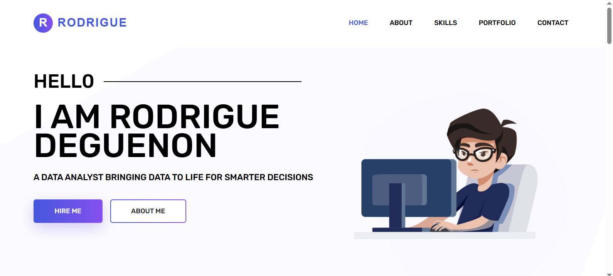
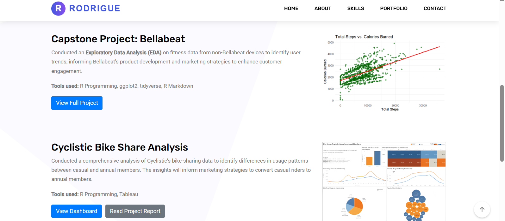

# Rodrigue's Data Analysis Portfolio

Welcome to my data analysis portfolio! This repository showcases my skills in data cleaning, exploration, visualization, and storytelling. Each project includes insights derived from real-world datasets, tools, and techniques I’ve used to solve data-driven problems.

## 🚀 Features

- **Interactive Portfolio Website**: A responsive and visually appealing website to showcase my projects and skills.
- **Project Showcase**: Detailed descriptions of my data analysis projects.
- **Contact Form**: Easy way to get in touch with me for collaboration or inquiries.

## 🛠️ Tools and Technologies

- **Programming Languages**: R, SQL
- **Data Visualization**: Tableau, ggplot2
- **Spreadsheets**: Excel, Google Sheets
- **Web Development**: HTML, CSS, JavaScript
- **Icons**: [Ion Icons](https://ionicons.com/)
- **Fonts**: [Google Fonts](https://fonts.google.com/)
- **Hosting**: [GitHub Pages](https://pages.github.com/)

## 📂 Projects

### 1. **Capstone Project: Bellabeat**
   - **Description**: Analyzed fitness data from non-Bellabeat devices to identify user trends, informing Bellabeat's product development and marketing strategies to enhance customer engagement.
   - **Tools Used**: R Programming, ggplot2, tidyverse, R Markdown
   - **View Project**: [Kaggle Notebook](https://www.kaggle.com/code/rodriguedeguenon/capstone-project-bellabeat)

### 2. **Cyclistic Bike Share Analysis**
   - **Description**: Analyzed cyclitic bike share data to identify rider behavior differences to inform marketing strategies to convert casual riders to annual riders. 
   - **Tools Used**: R Programming, Tableau
   - **Read Project Report**: [Read Project Report](./assets/documents/cyclistic_report.pdf)
   - **View Project Dashboard**: [View Project Dashboard](https://public.tableau.com/app/profile/rodrigue.deguenon/viz/CyclisticBikeShareAnalysis_17374684424790/Dashboard1)

*More projects coming soon! Stay tuned for exciting data analysis projects.*

## 👨‍💻 About Me

Hi, I’m Rodrigue Deguenon, a passionate data analyst with a strong interest in transforming raw data into actionable insights. I enjoy solving complex problems and creating data-driven solutions that help businesses make smarter decisions. My expertise includes data cleaning, visualization, and storytelling using tools like R, SQL, Tableau, and spreadsheets.

## 🌐 Live Demo

Check out my portfolio website: [Live Demo](https://zachrodrigue.github.io/)

## 📸 Screenshots

## 📄 License

This project is licensed under the MIT License. See the [LICENSE](LICENSE) file for details.

## 📧 Contact

- **Email**: [deguenonrodrigue@gmail.com](mailto:deguenonrodrigue@gmail.com)
- **LinkedIn**: [Rodrigue Zacharie Deguenon](https://linkedin.com/in/rodriguezachariedeguenon)
- **GitHub**: [zachrodrigue](https://github.com/zachrodrigue)
- **Kaggle**: [rodriguedeguenon](https://www.kaggle.com/rodriguedeguenon)